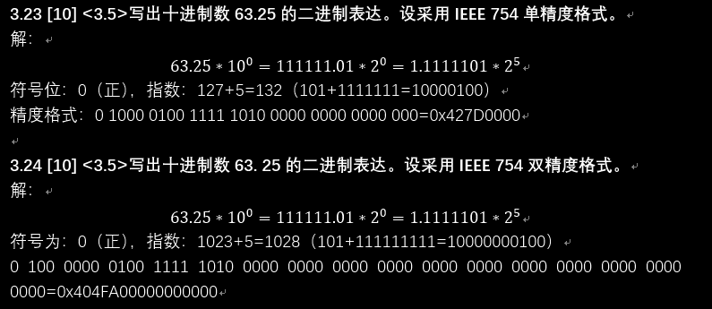
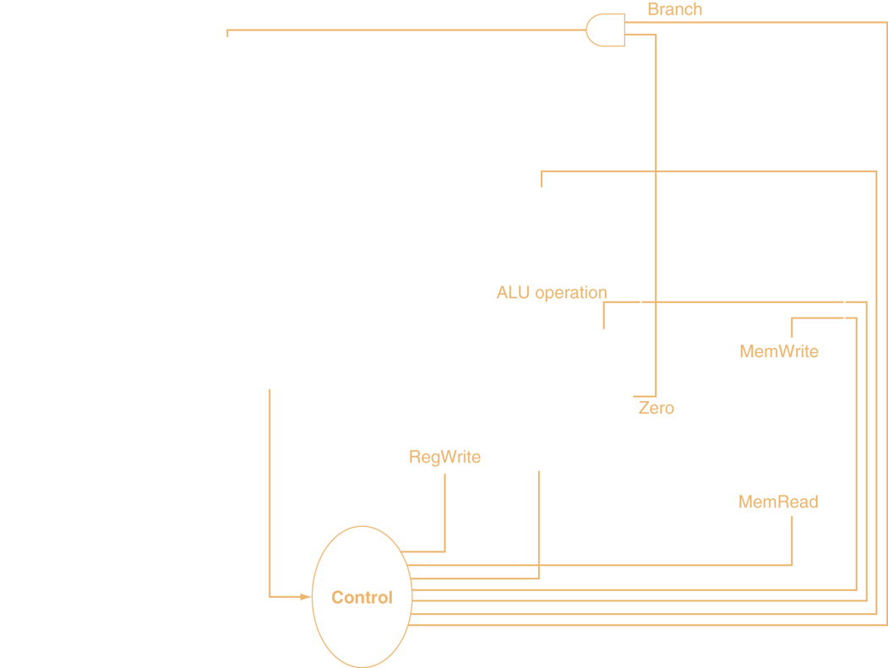
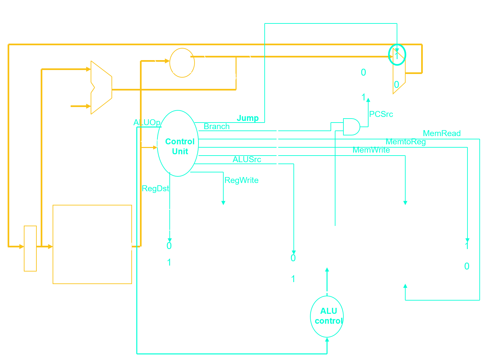
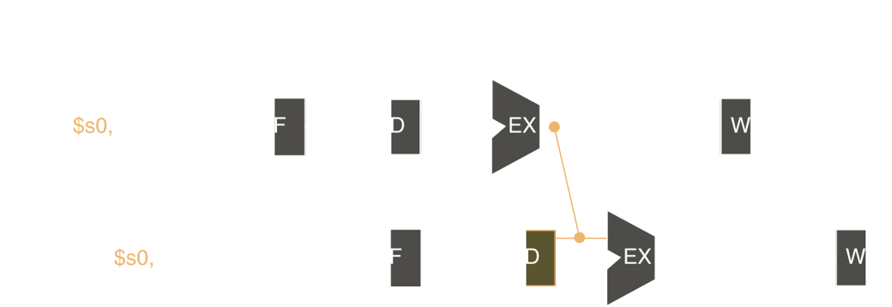
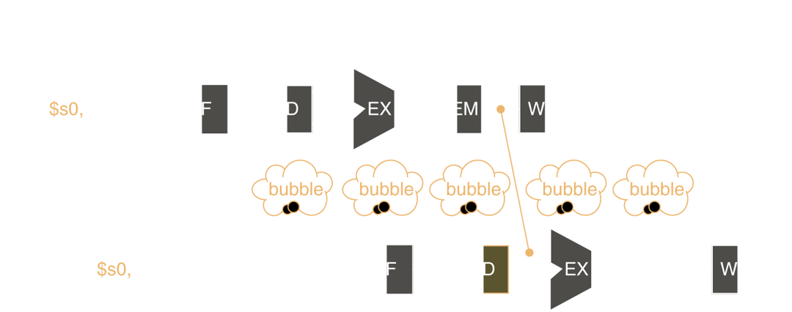

**1性能(功耗不用看)**
$$
CPU时间=指令数\times CPI\times 时钟周期数\\(CPUt=IC\times CPI\times CC)\\
Amdalh's\ Law:加速比：S_n=\frac{T_0}{T_{improve}}\qquad 可改进比Fe=\frac{可改进部分}{整体运行时间}\quad\\ 
性能=\frac 1{执行时间}\\
度量性能：MIPS=\frac{指令数}{执行时间\times 10^6}\\
MIPS=\frac{指令数}{指令数\times \frac{CPI}{时钟频率} \times 10^6}=\frac{时钟频率}{CPI\times 10^6}\\
1s=10^3ms=10^6\mu s=10^9ns\\
1GHz=10^3MHz=10^9Hz\\
几何平均的Spec=\sqrt[n]{\prod_{i=1}^nSpec_i}
$$

**2汇编**

​																	C到汇编
$$
R型指令\quad op(6)+rs(5)+rt(5)+rd(5)+shamt(5)+funct(6)\\\begin{array}{|}\hline
add \quad\$a,\$b,\$c&a=b+c\\\hline
srl\quad\$a,\$b,shamt&a=b>>shamt\\\hline
slt\quad\$a,\$b,\$c&a=(b<c)\\\hline
jr\quad\$a&跳转至\$a指定的指令\\\hline
\end{array}\\
$$

$$
I型指令\quad op(6)+rs(5)+rt(5)+immediate(16)\\\begin{array}{|}\hline
addi\quad $a,$b,100&a=b+100\\\hline
lw\quad $a,(4n)($b)&a=b[n]\\\hline
bne\quad $a,$b,loop&if(a\neq b) \ Goto\ loop\\\hline
\end{array}\\
$$

$$
J型指令\quad op(6)+address(26)\\\begin{array}{|}\hline
j\quad loop&Goto\ loop\\\hline
jal\quad 过程地址&将PC+4存储于\$ra中\\\hline
\end{array}\\
$$

$$
e.g.:B[8]=A[i-j]\qquad\begin{array}{|c|c|}\hline
f&g&h&i&j&A&B\\\hline\$S_1&\$S_2&\$S_3&\$S_4&\$S_5&\$S_6&\$S_7\\\hline
\end{array}\\\\
\begin{array}{|}\hline
sub\quad \$t_0,\$S_3,\$S_4&t_0=i-j\\
sll\quad \$t_0,\$t_0,2&t_0=t_0\times4\\
add\quad \$t_0,\$t_0,\$S_6&t_0=t_0+A基地址\\
lw\quad \$t_1,0(\$t_0)&t_1=A[i-j]\\
sw\quad \$t_1,32(\$t_1)&t1存入B[8]\\\hline
\end{array}
$$
寻址方式（P78，beq跳到哪里？（P115 2.42 0x1FFF f000）MIPS体系高四位必为0，该题非MIPS体系）

如果当前PC的值为*0x00000000*，希望跳到*0x20014924*（0010 0000 0000 0001 0100 1001 0010 0100）：

​		单独跳转：j target最远跳到0000 1111 1111 1111 1111 1111 1111 1100，取中间26位

​																	=*0x0FFFFFFC*   <   *0x20014924*，不能跳转

​		分支指令：<mark>bne的寻址PC+4+offset*4</mark>

​							令PC+4+offset$\times$4=*0x2001 4924*，解得offset=*0x800 50C8*

​							展开得  0010  0000  0000  0001  0100  0011  0010  0000

​									           绿色部分为offset，高位不能通过符号位扩展得到，不能跳转

​	$\$s$寄存器需要压栈，保存，$\$t$寄存器无需压栈，不保存（temp）

​	MIPS采用字节地址（8位一个地址）

 

3 **算术运算**
$$
IEEE:\begin{array}{|c|c|c|c|c|}
\hline半&1+5+10&mode\ 15\\
\hline单&1+8+23&mod\ 127\\
\hline双&1+11+52&mode\ 1023\\\hline
\end{array}\\
$$
​		在中间计算过程中，右边多保留两位：**保护位**、**舍入位**，当舍入位右边非0，**粘贴位**为1
$$
舍入规则：舍入到最接近，相同时偶数优先\\\begin{array}{|}\hline
逼近+\infin&ceil(1.3)=2 \qquad ceil(-1.3)=-1\\\hline
逼近-\infin&floor(1.3)=1 \quad floor(-1.3)=-2\\\hline
逼近\quad0& int(1.3)=1 \qquad int(-1.3)=-1\\\hline\end{array}
$$

4 处理器**（不考分支、控制冒险）**

beq由最上面的Mux控制PC = PC+4 or PC+4+offset*4

   

(黄线为Jump，lw/sw有Extend)

 看图，(add)走哪几个部件(计算耗时，取最大值为时钟周期，要考虑WB寄存器)

​    注意冒险阻塞    RAW （$r_1$）I1 to I2

​                  I1:  add $r_1$, $r_2$, $r_2$

​                  I2:  add $r_2$, $r_1$, $r_1$

​    “虽然有RAW现象，但是有/无冒险”

​																			此RAW冒险可转发解决阻塞

   

​												此装载-使用型(lw-sub)数据冒险，转发后仍阻塞一个周期

​																				

5 Cache**（不考虚拟存储）**
$$
\begin{array}{|}\hline
主存标记&Cache块号\\\hline
\end{array}\\
Cache总位数=2^n\times(块大小+标记域大小+有效位域大小)\\
=2^n\times(2^m\times32+(32-n-m-2)+1)\\
Cache命名不考虑标记域、有效位，只考虑数据的大小\\
$$

$$
4字/块,Cache大小=1K字=2^{10}\\
=\frac{1024}4=\frac{1024}{2^2}=256块=2^8\\
m=2，n=8
$$

>
By: 张昊琨

>
>
2021.6.30

>
>(Cache,一生之敌)

